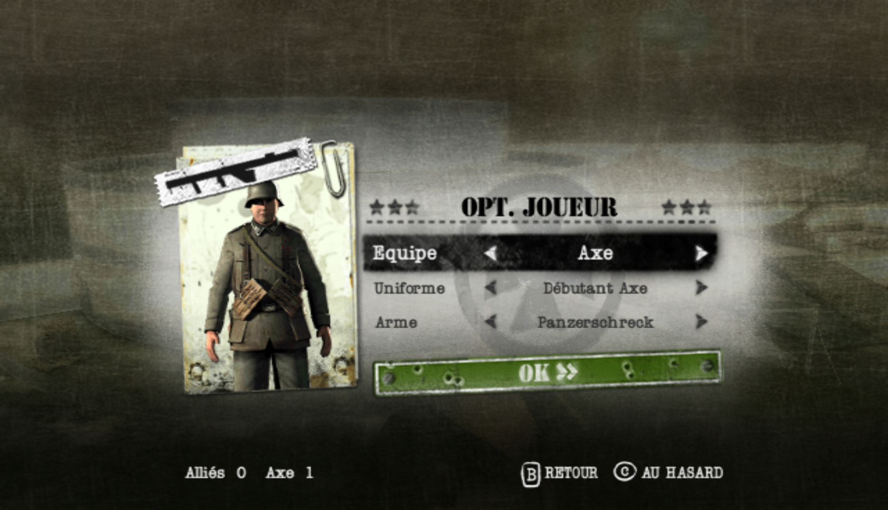
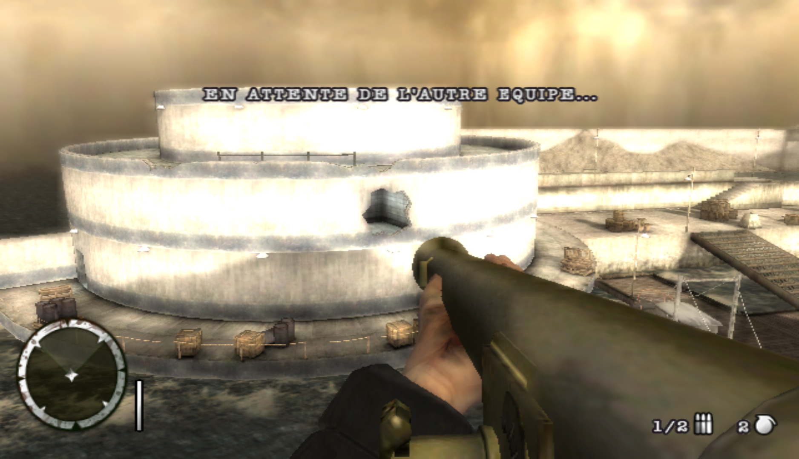

# Patches for Medal Of Honor Heroes 2 [Wii]

A project dedicated to connect the game to a private server, as well as some features.

Our implementation of the private server can be found here : https://github.com/a-blondel/mohh2-wii-server

## Riivolution patches

We are targetting each version of MoHH2 :
- RM2P69 : PAL UK
- RM2X69 : PAL EU (Fr,De,It,Es)
- RM2E69 : NTSC US
- RM2E69-beta : NTSC US (Oct 17, 2007 prototype)

### Available patches

- **Private Server**
  - **WFC replacement** : Required to use the private server. Currently only Wiimmfi is supported.
  - **Bypass pw encoding** : Required for private server.
  - **Serverless** : Allows to start a game alone without a working UDP server. **Beware : it crashes when taking damage !**
- **Mods**
  - **Online Panzerschreck** : Restores the panzerschreck for the germans (which was replaced by the M1 Bazooka on the Wii version while being available on the PSP version)  

  
*Panzerschreck label / ingame*
- **Misc**
  - **Menu Theme** : Change the theme menu, optional.
  - **Skip startup screens** : Skips the Wiimote and Zii Zapper alert screens on game startup to spare some time, optional.
  - **Skip EA intro** : Skips the intro to spare some time, optional.

### Usage

- Dolphin
  - Copy and Paste content of the `Riivolution` folder inside of your `Dolphin/User/Load/Riivolution` folder.
  - Right click on the game, click on `Start with Riivolution Patches`, click on `Open Riivolution XML...` and select the XML related to your version of the game.
  - Choose the patches you need.

## Symbols map

If needed, please check the `symbols-map` folder.
